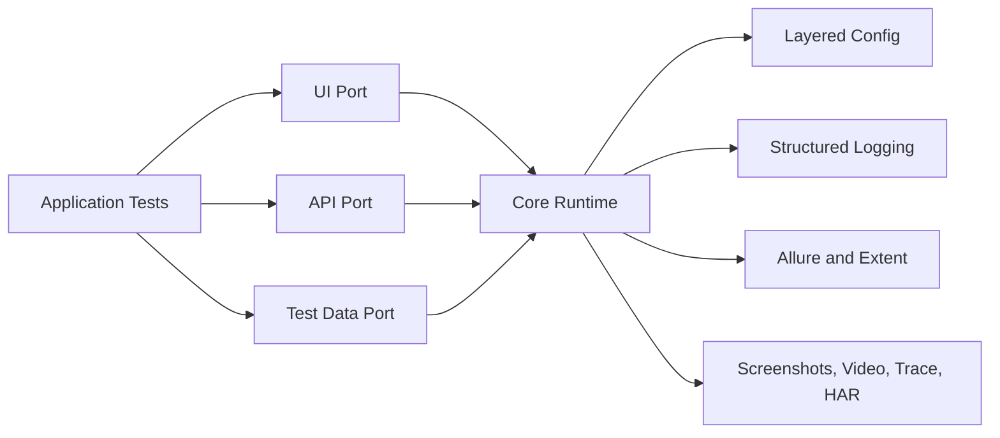
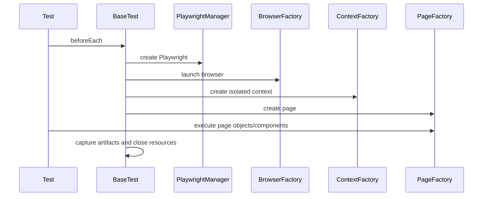
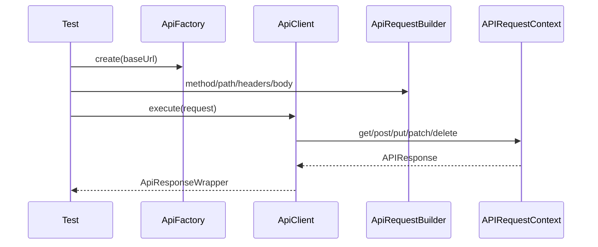

# Enterprise Automation Platform Design

## Vision

This repository is an automation framework template. The central automation team maintains the template, pushes it to Git, and each application team takes its own isolated copy for its application. Each team updates only its URLs, tests, page objects, data, and CI/CD settings. The framework owns cross-cutting behavior: configuration, Playwright lifecycle, API client behavior, reporting, logging, artifacts, security posture, governance, and CI/CD defaults.

The intended model is one application per framework copy. This avoids clutter from mixing multiple unrelated application suites in the same repository.

## Architecture

## Package Model

| Package | Responsibility |
| --- | --- |
| `config` | Loads `application.yaml`, `environment.yaml`, `execution.yaml`, then overlays JVM system properties such as `-Denv=qa` and `-Dbrowser=chromium`. |
| `context` | Holds execution and correlation IDs per thread for parallel test isolation and log traceability. |
| `core` | Shared platform primitives such as retry policy, quality gates, and future extension contracts. |
| `ui` | Playwright lifecycle, browser/context/page factories, page object base classes, wait engine, assertions, locator strategy, session and artifact management. |
| `api` | Playwright `APIRequestContext` client, request builder, response wrapper, auth headers, token storage, schema and contract validation. |
| `data` | JSON/YAML/CSV loading and dynamic data generation. Excel, database, and faker support are extension points to keep the core dependency policy strict. |
| `reporting` | Allure attachments and Extent report lifecycle. |
| `annotations` | JUnit 5 tags for smoke, regression, UI, API, and future governance categories. |
| `visual`, `accessibility`, `contract`, `observability`, `ai`, `integrations` | Stable ports for enterprise features whose concrete tools vary by organization. |
| `tests` | Sample UI, API, and hybrid tests that each application team replaces or extends inside its isolated framework copy. |

## Design Decisions

| Decision | Reason | Tradeoff |
| --- | --- | --- |
| Java 21 Maven template | Easy for each application team to pull, configure, and run independently. | Shared improvements must be merged back into the central template deliberately. |
| Playwright-only UI and API | One browser/runtime engine for UI, API, traces, HAR, and session sharing. | Teams familiar with REST Assured need onboarding. |
| JUnit 5 tags and annotations | Native filtering with `mvn test -Dgroups=smoke` style execution through Surefire. | Cucumber-style business syntax is intentionally excluded. |
| YAML layered config with JVM overrides | Keeps source code untouched across environments and pipelines. | Requires disciplined config ownership. |
| Thread-local execution context | Supports parallel execution while preserving correlation IDs. | Shared mutable state must still be avoided by tests. |
| Disabled sample tests | Keeps the platform build stable before real app URLs exist. | Teams must enable samples after environment setup. |

## UI Flow

## API Flow

## Scalability Strategy

The platform isolates browser contexts per test, uses thread-local execution metadata, and keeps API clients lightweight. Teams can scale by JUnit method, class, suite, browser, API, or container parallelization. Future grid expansion should be implemented behind the existing browser/context factories so tests remain unchanged.

## Security Strategy

Secrets must enter through environment variables, GitHub Secrets, Jenkins Credentials, or encrypted enterprise secret stores. No code path should hardcode credentials. Authentication helpers accept tokens and headers but do not own secret retrieval, which keeps the framework portable and auditable.

## Extension Strategy

AI self-healing, visual comparison, accessibility scanning, OpenTelemetry, database data loaders, Excel readers, and consumer-driven contract tools should be integrated through adapters under existing package boundaries. The platform should expose ports before adding vendor-specific dependencies.

## Naming Standards

Use clear domain nouns for classes, `*Factory` for object creation, `*Manager` for lifecycle or state coordination, `*Validator` for contract checks, and `*Assertions` for test assertions. Test names should describe behavior, not implementation.

## Onboarding

1. Set `environment.yaml` base URLs.
2. Run `mvn test -Denv=qa -Dbrowser=chromium -Dheadless=true`.
3. Add application page objects in the team's isolated repository.
4. Enable sample tests only after selectors and endpoints match a real application.

For application team URL setup, see `docs/MULTI_APPLICATION_URL_CONFIGURATION.md`.

For step-by-step test authoring, see `docs/NEW_TEST_AUTHOR_GUIDE.md`.

## Troubleshooting

| Symptom | Action |
| --- | --- |
| Browser launch fails | Run `mvn exec:java -Dexec.mainClass=com.microsoft.playwright.CLI -Dexec.args="install --with-deps"` in the team repository. |
| Wrong environment | Check `-Denv` and the matching key in `environment.yaml`. |
| Missing artifacts | Confirm `target/artifacts` is writable in the runner. |
| Tags not filtering | Prefer JUnit 5 tag expressions through Surefire groups configuration. |
